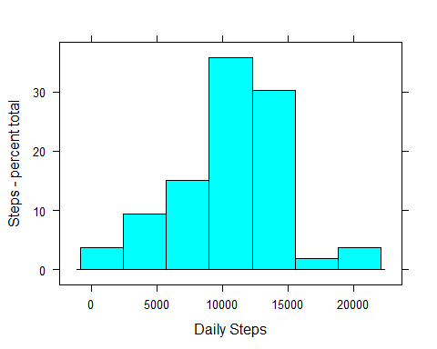
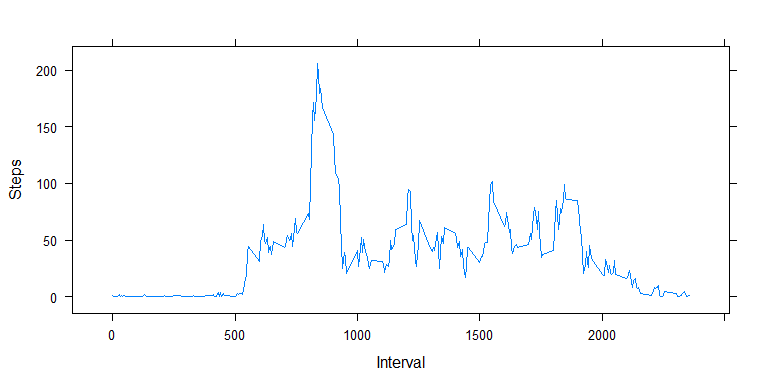
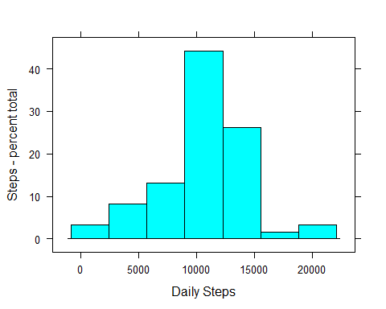
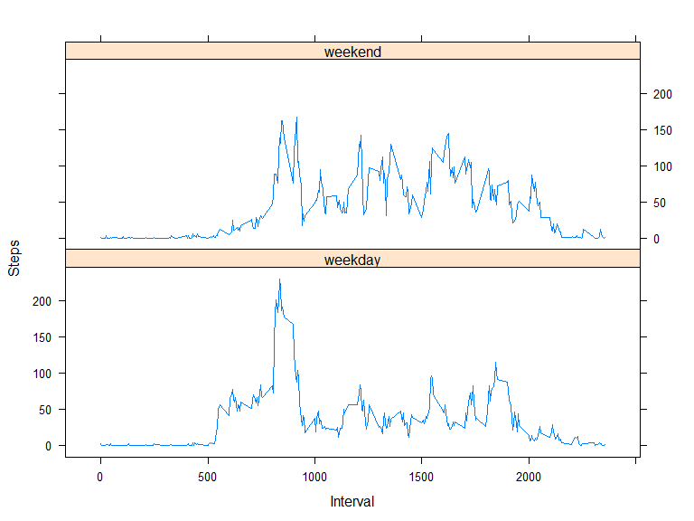

# Reproducible Research: Peer Assessment 1


## Loading and preprocessing the data
Original dataset used in this research is available [here](https://d396qusza40orc.cloudfront.net/repdata%2Fdata%2Factivity.zip) [53K]

The code below reads CSV and prepares data for further utiliasation in the project by creating two aggregates:
* total steps per day
* mean steps per day

```r
data <- read.csv("activity.csv")
AggrData1 <- aggregate(steps ~ date, sum, data=data)
AggrData2 <- aggregate(steps ~ interval, mean, data=data)
```
NOTE: aggregate() ignores NAs (it has na.rm=TRUE default) so the the end result here is the same as if aggregation was performed on the dataset that was subjected to na.omit() first.


Lastly, lattice package is loaded (package is installed if necessary)

```r
if (!"lattice" %in% installed.packages()[,"Package"]) 
    install.packages("lattice")
library(lattice)
```
This completes the praparation phase.


## What is mean total number of steps taken per day?
This histogram depicts a frequency distribution of daily step totals:

```r
histogram(AggrData1$steps, xlab = "Daily Steps", 
          ylab = "Steps - percent total")
```

 

Mean and Median of steps taken per day:

```r
mean(AggrData1$steps)
```

```
## [1] 10766.19
```

```r
median(AggrData1$steps)
```

```
## [1] 10765
```

## What is the average daily activity pattern?
Daily activity pattern basing on average number of steps taken during every 5 minute interval, averaged across all days.

```r
xyplot(AggrData2$steps ~ AggrData2$interval, t = "l", xlab = "Interval", 
       ylab = "Steps")
```

 

The most active interval is:

```r
subset(AggrData2, AggrData2$steps == max(AggrData2$steps))[, 1]
```

```
## [1] 835
```

## Imputing missing values
The strategy for imputing missing values used in this project is changing NAs with a mean value of the interval where NA result in question is located. So if a NA value occurs in interval 55 it is switched to a mean value for interval 55 basing on available observations for all days.

The following code achieves this:

```r
noNa <- data
for (i in 1:length(noNa[, 2])) {
    if (is.na(noNa[i, 1]) == TRUE) {
        noNa[i, 1] <- subset(AggrData2, AggrData2[, 1] == noNa[i, 3])[, 2]
    }
}
```

Additional data manipulation to get new daily totals:

```r
AggrData1noNa <- aggregate(steps ~ date, sum, data=noNa)
```

New Histogram shows slight changes - an increase in the most freequent series, but general distribution pattern remains quite similar to the original one.

```r
histogram(AggrData1noNa$steps, xlab = "Daily Steps", 
          ylab = "Steps - percent total")
```

 

New Mean and Median values show no significant change after imputing of missing values.

```r
mean(AggrData1noNa$steps)
```

```
## [1] 10766.19
```

```r
median(AggrData1noNa$steps)
```

```
## [1] 10766.19
```


## Are there differences in activity patterns between weekdays and weekends?

The code below prepares a dataset that adds in weekday factor

```r
noNaWD <- noNa 
noNaWD[weekdays(as.Date(noNaWD$date)) %in% c("Saturday", "Sunday"),
       4] <- "weekend"
noNaWD[!weekdays(as.Date(noNaWD$date)) %in% c("Saturday", "Sunday"),
       4] <- "weekday"
noNaWD[, 4] <- as.factor(noNaWD[, 4])
names(noNaWD)[4] <- "Day"
```

Additional data manuipulation to get the new interval based mean values for both weekdays and weekends.

```r
AggrData3noNaWD <- aggregate(steps ~ interval+Day, mean, data=noNaWD)
```

A dual plot depicting different patterns of step activity during weekends and weekdays:

```r
xyplot(AggrData3noNaWD$steps ~ AggrData3noNaWD$interval | AggrData3noNaWD$Day,
       t= "l", layout=c(1,2), xlab = "Interval", ylab = "Steps")
```

 
Two patterns have the following differences:
* more activity is performed in the morning on weekdays
* more activity is performed on weekends during the 'working hours'
